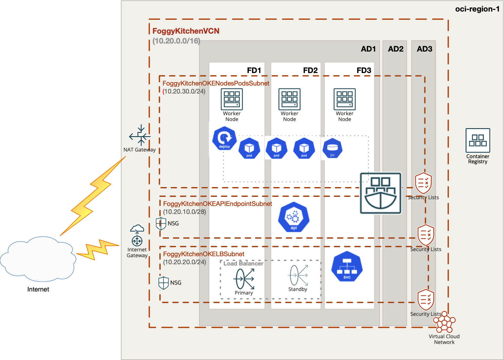

# OCI Container Engine for Kubernetes (aka OCI OKE) with image taken from OCI Registry (OCIR)

## Project description

In this repository, I have documented my hands on experience with Terrafrom for the purpose of Container Engine for Kubernetes (aka OCI OKE) deployment with image taken from OCI Registry (OCIR). This set of HCL based Terraform files which can customized according to any requirements.  

## Topology Diagram 

With the usage of this example HCL code you can build topology documented by diagram below. This topology is extremly simplified for education purposes and rather cannot be used for production implementations. 



## How to use code 

### Deploy Using Oracle Resource Manager

1. Click [](https://cloud.oracle.com/resourcemanager/stacks/create?region=home&zipUrl=https://github.com/mlinxfeld/terraform-oci-oke-ocir/releases/latest/download/terraform-oci-oke-ocir-stack-latest.zip)

    If you aren't already signed in, when prompted, enter the tenancy and user credentials.

2. Review and accept the terms and conditions.

3. Select the region where you want to deploy the stack.

4. Follow the on-screen prompts and instructions to create the stack.

5. After creating the stack, click **Terraform Actions**, and select **Plan**.

6. Wait for the job to be completed, and review the plan.

    To make any changes, return to the Stack Details page, click **Edit Stack**, and make the required changes. Then, run the **Plan** action again.

7. If no further changes are necessary, return to the Stack Details page, click **Terraform Actions**, and select **Apply**. 

### Deploy Using the Terraform CLI

#### STEP 1.

Clone the repo from GitHub.com by executing the command as follows and then go to terraform-oci-private-oke directory:

```
[opc@terraform-server ~]$ git clone https://github.com/mlinxfeld/terraform-oci-oke-ocir
Cloning into 'terraform-oci-oke-ocir'...
remote: Enumerating objects: 29, done.
remote: Counting objects: 100% (29/29), done.
remote: Compressing objects: 100% (20/20), done.
remote: Total 29 (delta 9), reused 28 (delta 8), pack-reused 0
Receiving objects: 100% (29/29), 308.42 KiB | 2.27 MiB/s, done.
Resolving deltas: 100% (9/9), done.

[opc@terraform-server ~]$ cd terraform-oci-oke-ocir/

[opc@terraform-server terraform-oci-oke-ocir]$ ls -latr

drwxr-xr-x  90 lfeldman  staff    2880 Sep 15 10:59 ..
-rw-r--r--   1 lfeldman  staff   19649 Sep 15 11:00 README.md
-rw-r--r--   1 lfeldman  staff     292 Sep 15 11:00 compartment.tf
-rw-r--r--   1 lfeldman  staff   16085 Sep 15 11:00 network.tf
-rw-r--r--   1 lfeldman  staff    1968 Sep 15 11:00 oke.tf
-rw-r--r--   1 lfeldman  staff     350 Sep 15 11:00 outputs.tf
-rw-r--r--   1 lfeldman  staff    6452 Sep 15 11:00 schema.yaml
-rw-r--r--   1 lfeldman  staff      80 Sep 15 11:00 tls.tf
-rw-r--r--   1 lfeldman  staff     743 Sep 15 11:19 provider.tf
-rw-r--r--   1 lfeldman  staff    2546 Sep 15 11:27 variables.tf
-rw-r--r--   1 lfeldman  staff    1742 Sep 15 11:34 locals.tf
drwxr-xr-x   6 lfeldman  staff     192 Sep 15 12:33 templates
-rw-r--r--   1 lfeldman  staff    2241 Sep 15 12:56 datasources.tf
-rw-r--r--   1 lfeldman  staff    3569 Sep 16 13:35 deploy.tf
drwxr-xr-x  22 lfeldman  staff     704 Sep 16 13:43 .
```

#### STEP 2.

Within web browser go to URL: https://www.terraform.io/downloads.html. Find your platform and download the latest version of your terraform runtime. Add directory of terraform binary into PATH and check terraform version:

```
[opc@terraform-server terraform-oci-oke-ocir]$ export PATH=$PATH:/home/opc/terraform

[opc@terraform-server terraform-oci-oke-ocir]$ terraform --version

Terraform v1.0.0

Your version of Terraform is out of date! The latest version
is 1.2.2. You can update by downloading from https://www.terraform.io/downloads.html
```

#### STEP 3. 
Next create environment file with TF_VARs:

```
[opc@terraform-server terraform-oci-oke-ocir]$ vi setup_oci_tf_vars.sh
export TF_VAR_user_ocid="ocid1.user.oc1..aaaaaaaaob4qbf2(...)uunizjie4his4vgh3jx5jxa"
export TF_VAR_tenancy_ocid="ocid1.tenancy.oc1..aaaaaaaas(...)krj2s3gdbz7d2heqzzxn7pe64ksbia"
export TF_VAR_compartment_ocid="ocid1.tenancy.oc1..aaaaaaaasbktyckn(...)ldkrj2s3gdbz7d2heqzzxn7pe64ksbia"
export TF_VAR_fingerprint="00:f9:d1:41:bb:57(...)82:47:e6:00"
export TF_VAR_private_key_path="/tmp/oci_api_key.pem"
export TF_VAR_region="eu-frankfurt-1"
export TF_VAR_ocir_user_name="<oci_iam_user>"
export TF_VAR_ocir_user_password="<oci_iam_auth_token>"

[opc@terraform-server terraform-oci-oke-ocir]$ source setup_oci_tf_vars.sh
```

#### STEP 4.
Run *terraform init* with upgrade option just to download the lastest neccesary providers:

```
[opc@terraform-server terraform-oci-oke-ocir]$ terraform init 

Initializing the backend...

Initializing provider plugins...
- Finding latest version of hashicorp/null...
- Finding latest version of hashicorp/template...
- Finding latest version of oracle/oci...
- Finding latest version of hashicorp/random...
- Finding latest version of hashicorp/tls...
- Finding latest version of hashicorp/local...
- Installing hashicorp/template v2.2.0...
- Installed hashicorp/template v2.2.0 (signed by HashiCorp)
- Installing oracle/oci v4.84.0...
- Installed oracle/oci v4.84.0 (signed by a HashiCorp partner, key ID 1533A49284137CEB)
- Installing hashicorp/random v3.3.1...
- Installed hashicorp/random v3.3.1 (signed by HashiCorp)
- Installing hashicorp/tls v3.4.0...
- Installed hashicorp/tls v3.4.0 (signed by HashiCorp)
- Installing hashicorp/local v2.2.3...
- Installed hashicorp/local v2.2.3 (signed by HashiCorp)
- Installing hashicorp/null v3.1.1...
- Installed hashicorp/null v3.1.1 (signed by HashiCorp)

Partner and community providers are signed by their developers.
If you'd like to know more about provider signing, you can read about it here:
https://www.terraform.io/docs/cli/plugins/signing.html

Terraform has created a lock file .terraform.lock.hcl to record the provider
selections it made above. Include this file in your version control repository
so that Terraform can guarantee to make the same selections by default when
you run "terraform init" in the future.

Terraform has been successfully initialized!

You may now begin working with Terraform. Try running "terraform plan" to see
any changes that are required for your infrastructure. All Terraform commands
should now work.

If you ever set or change modules or backend configuration for Terraform,
rerun this command to reinitialize your working directory. If you forget, other
commands will detect it and remind you to do so if necessary.
```

#### STEP 5.
Run *terraform apply* to provision the content of this repo (type **yes** to confirm the the apply phase):

```
[opc@terraform-server terraform-oci-oke-ocir]$ terraform apply

data.template_file.dockerfile_deployment: Reading...
data.template_file.dockerfile_deployment: Read complete after 0s [id=1ac7ce1728be676fb9c803f88f073d72624b667d3ceea17887a0b0f700132721]
data.oci_objectstorage_namespace.test_namespace: Reading...
data.oci_identity_regions.oci_regions: Reading...
data.oci_identity_region_subscriptions.home_region_subscriptions: Reading...
data.oci_identity_availability_domains.ADs: Reading...
data.oci_containerengine_cluster_option.FoggyKitchenOKEClusterOption: Reading...
data.oci_core_services.FoggyKitchenAllOCIServices: Reading...
data.oci_containerengine_node_pool_option.FoggyKitchenOKEClusterNodePoolOption: Reading...
data.oci_identity_regions.oci_regions: Read complete after 1s [id=IdentityRegionsDataSource-0]
data.oci_objectstorage_namespace.test_namespace: Read complete after 1s [id=ObjectStorageNamespaceDataSource-3269541301]
data.template_file.indexhtml_deployment: Reading...
data.template_file.nginx_deployment: Reading...
data.template_file.indexhtml_deployment: Read complete after 0s [id=f1708f84b83fab648444befba3eb33e5e75fb7fa8f0f2fdeb30b46c9af6551af]
data.template_file.nginx_deployment: Read complete after 0s [id=c37103f5919624c203259b44551828f3d4063f1246451ec1c026b5de415522f3]
data.oci_identity_availability_domains.ADs: Read complete after 1s [id=IdentityAvailabilityDomainsDataSource-3269541301]
data.oci_identity_region_subscriptions.home_region_subscriptions: Read complete after 1s [id=IdentityRegionSubscriptionsDataSource-3269541301]
data.oci_core_services.FoggyKitchenAllOCIServices: Read complete after 1s [id=CoreServicesDataSource-0]
data.oci_containerengine_cluster_option.FoggyKitchenOKEClusterOption: Read complete after 2s [id=ContainerengineClusterOptionDataSource-1870923232]
data.oci_containerengine_node_pool_option.FoggyKitchenOKEClusterNodePoolOption: Read complete after 4s [id=ContainerengineNodePoolOptionDataSource-1870923232]

Terraform used the selected providers to generate the following execution plan. Resource actions are indicated with the following symbols:
  + create
 <= read (data resources)

(...)

Plan: 27 to add, 0 to change, 0 to destroy.

Changes to Outputs:
  + cluster_instruction = (known after apply)

Do you want to perform these actions?
  Terraform will perform the actions described above.
  Only 'yes' will be accepted to approve.

  Enter a value: yes

tls_private_key.public_private_key_pair: Creating...
local_file.dockerfile_deployment: Creating...
local_file.indexhtml_deployment: Creating...
local_file.nginx_deployment: Creating...
local_file.nginx_deployment: Creation complete after 0s [id=7c6ef92cb6dc96aa2393ead3efbc1a8ba7d64065]
local_file.indexhtml_deployment: Creation complete after 0s [id=23e28965233454dc7a71965476fc9742ef81e5c9]
local_file.dockerfile_deployment: Creation complete after 0s [id=9c05f8f8371a058f5c017c23419828e747c26895]
tls_private_key.public_private_key_pair: Creation complete after 0s [id=229a4e8e8fd722c90a65735f2fac89b300cefe85]
oci_identity_compartment.FoggyKitchenCompartment: Creating...

(...)

null_resource.deploy_to_ocir (local-exec): Executing: ["/bin/sh" "-c" "docker push fra.ocir.io/foggykitchen/fknginx/fknginx:latest"]
null_resource.deploy_to_ocir (local-exec): The push refers to repository [fra.ocir.io/foggykitchen/fknginx/fknginx]
null_resource.deploy_to_ocir (local-exec): c177a149262e: Preparing
null_resource.deploy_to_ocir (local-exec): 84b5f4633725: Preparing
null_resource.deploy_to_ocir (local-exec): 5a1e0c71cc20: Preparing
null_resource.deploy_to_ocir (local-exec): ee41be83db3d: Preparing
null_resource.deploy_to_ocir (local-exec): 7d3ff2ac9cc6: Preparing
null_resource.deploy_to_ocir (local-exec): 4955fcf02a40: Preparing
null_resource.deploy_to_ocir (local-exec): 5d3e392a13a0: Preparing
null_resource.deploy_to_ocir (local-exec): 4955fcf02a40: Waiting
null_resource.deploy_to_ocir (local-exec): 5d3e392a13a0: Waiting
null_resource.deploy_to_ocir (local-exec): 7d3ff2ac9cc6: Layer already exists
null_resource.deploy_to_ocir (local-exec): ee41be83db3d: Layer already exists
null_resource.deploy_to_ocir (local-exec): 84b5f4633725: Layer already exists
null_resource.deploy_to_ocir (local-exec): 5a1e0c71cc20: Layer already exists
null_resource.deploy_to_ocir (local-exec): c177a149262e: Layer already exists
null_resource.deploy_to_ocir (local-exec): 4955fcf02a40: Layer already exists
null_resource.deploy_to_ocir (local-exec): 5d3e392a13a0: Layer already exists
null_resource.deploy_to_ocir (local-exec): latest: digest: sha256:395b2fc64ab1a0e0202df2d08d03662e049123da82eb09dcf51d274ca3012f2b size: 1775
null_resource.deploy_to_ocir: Creation complete after 5s [id=2666581735337485953]
null_resource.deploy_oke_nginx: Creating...
null_resource.deploy_oke_nginx: Provisioning with 'local-exec'...
null_resource.deploy_oke_nginx (local-exec): Executing: ["/bin/sh" "-c" "oci ce cluster create-kubeconfig --region eu-frankfurt-1 --cluster-id ocid1.cluster.oc1.eu-frankfurt-1.aaaaaaaaotwjjmsjrqpkvwzm243gkmivtowpbrex5mesedgudcoe2unz6qea"]
null_resource.deploy_oke_nginx (local-exec): Existing Kubeconfig file found at /Users/mlinxfeld/.kube/config and new config merged into it
null_resource.deploy_oke_nginx: Provisioning with 'local-exec'...
null_resource.deploy_oke_nginx (local-exec): Executing: ["/bin/sh" "-c" "kubectl create secret docker-registry ocirsecret --docker-server=fra.ocir.io --docker-username='martin.linxfeld@foggykitchen.com' --docker-password='************' --docker-email='martin.linxfeld@foggykitchen.com' "]
null_resource.deploy_oke_nginx (local-exec): secret/ocirsecret created
null_resource.deploy_oke_nginx: Provisioning with 'local-exec'...
null_resource.deploy_oke_nginx (local-exec): Executing: ["/bin/sh" "-c" "kubectl apply -f ./nginx.yaml"]
null_resource.deploy_oke_nginx (local-exec): deployment.apps/nginx-deployment created
null_resource.deploy_oke_nginx: Provisioning with 'local-exec'...
null_resource.deploy_oke_nginx (local-exec): Executing: ["/bin/sh" "-c" "kubectl apply -f ./service.yaml"]
null_resource.deploy_oke_nginx (local-exec): service/lb-service created
null_resource.deploy_oke_nginx: Provisioning with 'local-exec'...
null_resource.deploy_oke_nginx (local-exec): Executing: ["/bin/sh" "-c" "sleep 60"]
null_resource.deploy_oke_nginx: Still creating... [10s elapsed]
null_resource.deploy_oke_nginx: Still creating... [20s elapsed]
null_resource.deploy_oke_nginx: Still creating... [30s elapsed]
null_resource.deploy_oke_nginx: Still creating... [40s elapsed]
null_resource.deploy_oke_nginx: Still creating... [50s elapsed]
null_resource.deploy_oke_nginx: Still creating... [1m0s elapsed]
null_resource.deploy_oke_nginx: Provisioning with 'local-exec'...
null_resource.deploy_oke_nginx (local-exec): Executing: ["/bin/sh" "-c" "kubectl get pods"]
null_resource.deploy_oke_nginx (local-exec): NAME                                READY   STATUS    RESTARTS   AGE
null_resource.deploy_oke_nginx (local-exec): nginx-deployment-55c5657844-2d96n   1/1     Running   0          63s
null_resource.deploy_oke_nginx (local-exec): nginx-deployment-55c5657844-4hnqj   1/1     Running   0          64s
null_resource.deploy_oke_nginx (local-exec): nginx-deployment-55c5657844-56hl6   1/1     Running   0          64s
null_resource.deploy_oke_nginx (local-exec): nginx-deployment-55c5657844-crmzj   1/1     Running   0          64s
null_resource.deploy_oke_nginx (local-exec): nginx-deployment-55c5657844-dlfsl   1/1     Running   0          63s
null_resource.deploy_oke_nginx (local-exec): nginx-deployment-55c5657844-hzfch   1/1     Running   0          64s
null_resource.deploy_oke_nginx (local-exec): nginx-deployment-55c5657844-kbtxz   1/1     Running   0          64s
null_resource.deploy_oke_nginx (local-exec): nginx-deployment-55c5657844-nhh45   1/1     Running   0          63s
null_resource.deploy_oke_nginx (local-exec): nginx-deployment-55c5657844-rr9jg   1/1     Running   0          64s
null_resource.deploy_oke_nginx (local-exec): nginx-deployment-55c5657844-wqz4v   1/1     Running   0          64s
null_resource.deploy_oke_nginx: Provisioning with 'local-exec'...
null_resource.deploy_oke_nginx (local-exec): Executing: ["/bin/sh" "-c" "kubectl get services"]
null_resource.deploy_oke_nginx (local-exec): NAME         TYPE           CLUSTER-IP      EXTERNAL-IP     PORT(S)             AGE
null_resource.deploy_oke_nginx (local-exec): kubernetes   ClusterIP      10.96.0.1       <none>          443/TCP,12250/TCP   5m21s
null_resource.deploy_oke_nginx (local-exec): lb-service   LoadBalancer   10.96.145.168   144.21.35.158   80:31749/TCP        63s
null_resource.deploy_oke_nginx: Provisioning with 'local-exec'...
null_resource.deploy_oke_nginx (local-exec): Executing: ["/bin/sh" "-c" "lb_ip_addpress=$(kubectl get service lb-service | awk  -F ' ' '{print $4}' | sed -n 2p) ; echo 'curl lb_ip_addpress:' ; curl $lb_ip_addpress"]
null_resource.deploy_oke_nginx (local-exec): curl lb_ip_addpress:
null_resource.deploy_oke_nginx (local-exec):   % Total    % Received % Xferd  Average Speed   Time    Time     Time  Current
null_resource.deploy_oke_nginx (local-exec):                                  Dload  Upload   Total   Spent    Left  Speed
null_resource.deploy_oke_nginx (local-exec):   0     0    0     0    0     0      0      0 --:--:-- --:--:-- --:--:--     0
null_resource.deploy_oke_nginx (local-exec): 100   132  100   132    0     0   1038      0 --:--:-- --:--:-- --:--:--  1189
null_resource.deploy_oke_nginx (local-exec): Hello, here is FoggyKitchen.com deployed in OKE based on image taken from OCIR (fra.ocir.io/foggykitchen/fknginx/fknginx:latest)!
null_resource.deploy_oke_nginx: Creation complete after 1m12s [id=8497531401026879024]

Apply complete! Resources: 27 added, 0 changed, 0 destroyed.

Outputs:

cluster_instruction = <<EOT
1.  Open OCI Cloud Shell.

2.  Execute below command to setup OKE cluster access:

$ oci ce cluster create-kubeconfig --region eu-frankfurt-1 --cluster-id ocid1.cluster.oc1.eu-frankfurt-1.aaaaaaaaotwjjmsjrqpkvwzm243gkmivtowpbrex5mesedgudcoe2unz6qea

3.  Get PODs names:

$ kubectl get pods

4.  Get services

$ kubectl get services


EOT
```

#### STEP 6.
After testing the environment you can remove the OCI OKE infra. You should just run *terraform destroy* (type **yes** for confirmation of the destroy phase):

```
[opc@terraform-server terraform-oci-oke-ocir]$ terraform destroy -auto-approve
data.template_file.dockerfile_deployment: Reading...
tls_private_key.public_private_key_pair: Refreshing state... [id=229a4e8e8fd722c90a65735f2fac89b300cefe85]
data.template_file.dockerfile_deployment: Read complete after 0s [id=1ac7ce1728be676fb9c803f88f073d72624b667d3ceea17887a0b0f700132721]
local_file.dockerfile_deployment: Refreshing state... [id=9c05f8f8371a058f5c017c23419828e747c26895]
data.oci_identity_availability_domains.ADs: Reading...
data.oci_containerengine_cluster_option.FoggyKitchenOKEClusterOption: Reading...
data.oci_containerengine_node_pool_option.FoggyKitchenOKEClusterNodePoolOption: Reading...
data.oci_core_services.FoggyKitchenAllOCIServices: Reading...
data.oci_objectstorage_namespace.test_namespace: Reading...
data.oci_identity_region_subscriptions.home_region_subscriptions: Reading...
data.oci_identity_regions.oci_regions: Reading...
data.oci_objectstorage_namespace.test_namespace: Read complete after 1s [id=ObjectStorageNamespaceDataSource-3269541301]
data.oci_identity_regions.oci_regions: Read complete after 1s [id=IdentityRegionsDataSource-0]
data.template_file.indexhtml_deployment: Reading...
data.template_file.nginx_deployment: Reading...
data.template_file.indexhtml_deployment: Read complete after 0s [id=f1708f84b83fab648444befba3eb33e5e75fb7fa8f0f2fdeb30b46c9af6551af]
data.template_file.nginx_deployment: Read complete after 0s [id=c37103f5919624c203259b44551828f3d4063f1246451ec1c026b5de415522f3]
local_file.nginx_deployment: Refreshing state... [id=7c6ef92cb6dc96aa2393ead3efbc1a8ba7d64065]
local_file.indexhtml_deployment: Refreshing state... [id=23e28965233454dc7a71965476fc9742ef81e5c9]
data.oci_containerengine_cluster_option.FoggyKitchenOKEClusterOption: Read complete after 1s [id=ContainerengineClusterOptionDataSource-1870923232]
data.oci_identity_availability_domains.ADs: Read complete after 1s [id=IdentityAvailabilityDomainsDataSource-3269541301]
data.oci_identity_region_subscriptions.home_region_subscriptions: Read complete after 1s [id=IdentityRegionSubscriptionsDataSource-3269541301]
data.oci_core_services.FoggyKitchenAllOCIServices: Read complete after 1s [id=CoreServicesDataSource-0]
oci_identity_compartment.FoggyKitchenCompartment: Refreshing state... [id=ocid1.compartment.oc1..aaaaaaaayxvhhjidfxsq35muvshgxv62ac2mn6mi2yo2xqzsq53jgkuozfwq]
data.oci_containerengine_node_pool_option.FoggyKitchenOKEClusterNodePoolOption: Read complete after 2s [id=ContainerengineNodePoolOptionDataSource-1870923232]
oci_core_virtual_network.FoggyKitchenVCN: Refreshing state... [id=ocid1.vcn.oc1.eu-frankfurt-1.amaaaaaanlc5nbyahdxz37vukjik7fsqcazvx4qdrg22k3bdz6jp63wpwyfq]
oci_core_network_security_group.FoggyKitchenNSG: Refreshing state... [id=ocid1.networksecuritygroup.oc1.eu-frankfurt-1.aaaaaaaaiwp4d3qvrirhdxc3wmur3lwgrw5uqdy2pcepmezdqbqpcl6h7phq]
oci_core_internet_gateway.FoggyKitchenInternetGateway: Refreshing state... [id=ocid1.internetgateway.oc1.eu-frankfurt-1.aaaaaaaaxbhkunvw4ergr2ybkzan4jvizu5qqm5s6gauthjm4yaccm66kopa]
oci_core_nat_gateway.FoggyKitchenNATGateway: Refreshing state... [id=ocid1.natgateway.oc1.eu-frankfurt-1.aaaaaaaaphmoew5alvt5aqssiwx7mbdpkjqzivofhbop5ra5yxzqhsok46oq]
oci_core_service_gateway.FoggyKitchenServiceGateway: Refreshing state... [id=ocid1.servicegateway.oc1.eu-frankfurt-1.aaaaaaaagyrsa5ld4q3jkysf5bdjwjjgdarg76ke33jga7gnwbb4gxzmiita]
oci_core_network_security_group.FoggyKitchenOKELBSecurityGroup[0]: Refreshing state... [id=ocid1.networksecuritygroup.oc1.eu-frankfurt-1.aaaaaaaa4vywd6yffv5tdkc7fuocd3ydatrcpd7kwatyykk6seamcuev7mra]

(...)

oci_core_virtual_network.FoggyKitchenVCN: Destruction complete after 1s
oci_identity_compartment.FoggyKitchenCompartment: Destroying... [id=ocid1.compartment.oc1..aaaaaaaayxvhhjidfxsq35muvshgxv62ac2mn6mi2yo2xqzsq53jgkuozfwq]
oci_identity_compartment.FoggyKitchenCompartment: Destruction complete after 0s

Destroy complete! Resources: 27 destroyed.
```
